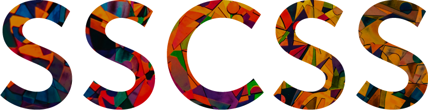

<p align="center">
  <a href="https://github.com/sebastianmusial/SSCSS">
    
  </a>
</p>
<p align="center">
  The light Sass library for managing your sizes and dimensions across breakpoints.
</p>

<p align="center">
	<strong>@Articles:</strong><br>
  <a href="https://medium.com/@sebastianmusia/how-to-style-modern-applications-in-a-simple-way-f93e95cd6962" target="blank">How to style modern applications in a simple way?</a>
</p>

## Installation

`npm i sscss`

Create your own `_core.scss` file with imports:
```
@import 'your-own-variables-and-settings';
@import '~sscss/sscss';
```
The file should be imported in all components where you will use Sass inheritances (@extend).

## Settings

In the settings, you can use your own breakpoints in the `px` unit.<br>
The `interpolation` key (boolean) in the map is optional and allows overwriting your global settings.

Example of breakpoints:

```
$mobile: 320px;
$tablet: 768px;
$desktop: 1024px;
```

Example of required settings:
```
$sscss-font-size: (
  'small':    ($mobile: 12px,  $tablet: 14px,  $desktop: 16px,  'interpolation': true),
  'medium':   ($mobile: 14px,  $tablet: 18px),
  'big':      ($mobile: 24px),
);

$sscss-dimension: (
  'small':    ($mobile: 4px,   $tablet: 8px,   $desktop: 16px,  'interpolation': true),
  'medium':   ($mobile: 8px,   $desktop: 32px),
  'big':      ($mobile: 16px,  $tablet: 32px,  'interpolation': false),
);
```

---
In the app you can use:

* the `@extend` approach allows you avoid styles generated outside your components.
* the `.class` approach allows you to generate small global utility classes. 
* the linear interpolation or standard breakpoint behaviors.

Example of optional global settings:
```
$sscss-font-interpolation: false;
$sscss-font-as-class: false;

$sscss-dimension-interpolation: false;
$sscss-dimension-as-class: false;
```

| Variable | Description | Default |
| --- | --- | --- |
| `$sscss-font-interpolation` | Settings for linear interpolation. | `false` |
| `$sscss-font-as-class` | Settings for `.class` or `@extend` approach. | `false` |
| `$sscss-dimension-interpolation` | Settings for linear interpolation. | `false` |
| `$sscss-dimension-as-class` | Settings for `.class` or `@extend` approach. | `false` |

## Usage

<details open><summary>Fonts</summary>

Name is generated based on a `$sscss-font-size` variable.

| Extensions | Class |
| --- | --- |
| `@extend %u-font-size--{name}` | `.u-font-size--{name}` | `.%u-font-size--{name}` |
</details>

<details open><summary>Paddings</summary>

Name is generated based on a `$sscss-dimension` variable.

| Extension | Class | Description |
| --- | --- | --- |
| `@extend %u-padding--{name}` | `.u-padding--{name}` |  Padding top, right, bottom, left |
| `@extend %u-padding--top-{name}` | `.u-padding--top-{name}` |  Padding top |
| `@extend %u-padding--right-{name}` | `.u-padding--right-{name}` |  Padding right |
| `@extend %u-padding--bottom-{name}` | `.u-padding--bottom-{name}` |  Padding bottom |
| `@extend %u-padding--left-{name}` | `.u-padding--left-{name}` |  Padding left |
| `@extend %u-padding--v-{name}` | `.u-padding--v-{name}` |  Padding top, bottom (vertical) |
| `@extend %u-padding--h-{name}` | `.u-padding--h-{name}` |  Padding right, left (horizontal) |
</details>

<details open><summary>Margins</summary>

Name is generated based on a `$sscss-dimension` variable.

| Extension | Class | Description |
| --- | --- | --- |
| `@extend %u-margin--{name}` | `.u-margin--{name}` | Margin top, right, bottom, left |
| `@extend %u-margin--top-{name}` | `.u-margin--top-{name}` | Margin top |
| `@extend %u-margin--right-{name}` | `.u-margin--right-{name}` | Margin right |
| `@extend %u-margin--bottom-{name}` | `.u-margin--bottom-{name}` | Margin bottom |
| `@extend %u-margin--left-{name}` | `.u-margin--left-{name}` | Margin left |
| `@extend %u-margin--v-{name}` | `.u-margin--v-{name}` | Margin top, bottom (vertical) |
| `@extend %u-margin--h-{name}` | `.u-margin--h-{name}` | Margin right, left (horizontal) |
| `@extend %u--margin--{name}` | `.u--margin--{name}` | Negative value of margin top, right, bottom, left |
| `@extend %u--margin--top-{name}` | `.u--margin--top-{name}` | Negative value of margin top |
| `@extend %u--margin--right-{name}` | `.u--margin--right-{name}` | Negative value of margin right |
| `@extend %u--margin--bottom-{name}` | `.u--margin--bottom-{name}` | Negative value of margin bottom |
| `@extend %u--margin--left-{name}` | `.u--margin--left-{name}` | Negative value of margin left |
| `@extend %u--margin--v-{name}` | `.u--margin--v-{name}` | Negative value of margin top, bottom (vertical) |
| `@extend %u--margin--h-{name}` | `.u--margin--h-{name}` | Negative value of margin right, left (horizontal) |
</details>

<details open><summary>Positions</summary>

Name is generated based on a `$sscss-dimension` variable.

| Extension | Class | Description |
| --- | --- | --- |
| `@extend %u-position--{name}` | `.u-position--{name}` | Position top, right, bottom, left |
| `@extend %u-position--top-{name}` | `.u-position--top-{name}` | Position top |
| `@extend %u-position--right-{name}` | `.u-position--right-{name}` | Position right |
| `@extend %u-position--bottom-{name}` | `.u-position--bottom-{name}` | Position bottom |
| `@extend %u-position--left-{name}` | `.u-position--left-{name}` | Position left |
| `@extend %u-position--v-{name}` | `.u-position--v-{name}` | Position top, bottom (vertical) |
| `@extend %u-position--h-{name}` | `.u-position--h-{name}` | Position right, left (horizontal) |
| `@extend %u--position--{name}` | `.u--position--{name}` | Negative value of position top, right, bottom, left |
| `@extend %u--position--top-{name}` | `.u--position--top-{name}` | Negative value of position top |
| `@extend %u--position--right-{name}` | `.u--position--right-{name}` | Negative value of position right |
| `@extend %u--position--bottom-{name}` | `.u--position--bottom-{name}` | Negative value of position bottom |
| `@extend %u--position--left-{name}` | `.u--position--left-{name}` | Negative value of position left |
| `@extend %u--position--v-{name}` | `.u--position--v-{name}` | Negative value of position top, bottom (vertical) |
| `@extend %u--position--h-{name}` | `.u--position--h-{name}` | Negative value of position right, left (horizontal) |
</details>

## Author

<table border="0">
  <tr>
    <td>
      <a href="https://github.com/sebastianmusial" style="color: white">
        
      </a>
    </td>
    <td>
      <p><strong>Sebastian Musiał</strong></p>
      <p> <a href="mailto:kontakt@sebastianmusial.pl">kontakt@sebastianmusial.pl</a></p>
      <p> <a href="https://twitter.com/SebaMusial">@sebamusial</a></p>
    </td>
  </tr>
</table>
